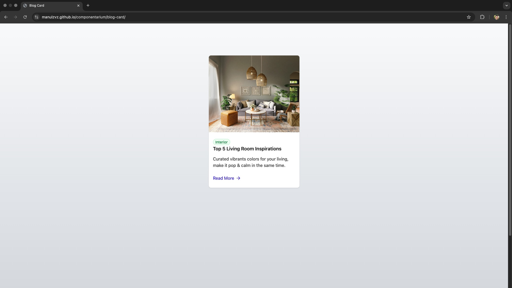

# Blog Card Component

[](https://github.com/manulzvz/componentarium/blog-card)

---

## Table of Contents

- [Blog Card Component](#blog-card-component)
  - [Table of Contents](#table-of-contents)
  - [Description](#description)
  - [Technologies](#technologies)
  - [Demo](#demo)
  - [Installation](#installation)
  - [Run Project](#run-project)
  - [Contributions](#contributions)
  - [Project Status](#project-status)
  - [Contact](#contact)

---

## Description

blog card featuring editorial content, including an article cover image, a content category tag, a title, a brief description, and a call-to-action (CTA) link.

## Technologies

- **Frontend:** React
- **Styles:** TailwindCSS
- **Tools:** Git, Prettier, ESLint, Vite

---

## Demo

[Live Demo](https://manulzvz.github.io/componentarium/blog-card/)



---

## Installation

```bash
# Clone repository
git clone https://github.com/manulzvz/componentarium/blog-card.git

# Enter project's directory
cd blog-card

# Install dependencies
npm install
```

## Run Project

```bash
npm start
```

For libraries or components, show how to import and use them.

```jsx
import BlogCard from "BlogCard.tsx";
<BlogCard props={...} />;
```

## Contributions

1. Fork the repository
2. Create a feature/new-feature branch
3. Commit your changes
4. Open a Pull Request

## Project Status

- Experimental

## Contact

GitHub: [manulzvz](https://github.com/manulzvz)

LinkedIn: [manulzvz](https://www.linkedin.com/in/manulzvz/)

Email: <manulzvz@gmail.com>

---

Made with ♥︎ by @manulzvz
